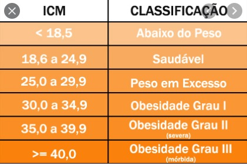

<h1 align="center"> Calculadora IMC 🩺 </h1>

## Sobre o projeto :bookmark:

​	Desenvolver uma calculadora IMC utilizando as tecnologias:

- JSP, JSTL
- Classes comuns e filtros
- Expressions languages

> Bônus: Criar página de acesso antes de exibir a calculadora

:warning: Requisito: utilizar todos os recursos de segurança vistos em aula.

## Classificação de IMC

###### Desenvolvimento de Sistemas II @ SENAI/BA 2021.2

